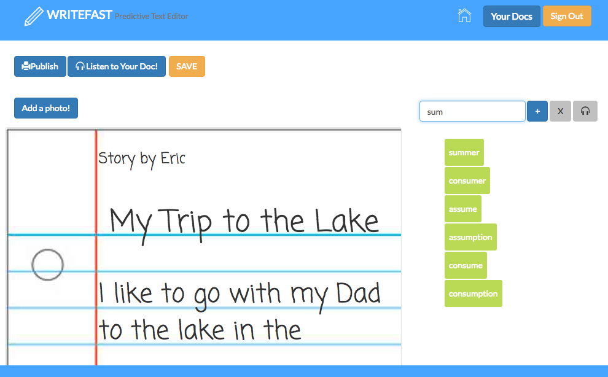

# WriteFast

WriteFast allows elementary-aged students with dysgraphia and agraphia to write with ease by suggesting words as the user composes sentences. Check out the project [here](http://www.writefast.herokuoapp.com).

This project was completed over the course of a two-day socially-minded hackathon at Dev Bootcamp in San Francisco. In addition to several Ruby gems, the app makes use of [ResponsiveVoice.js](http://responsivevoice.org/), a text-to-speech library.

# Screenshot

